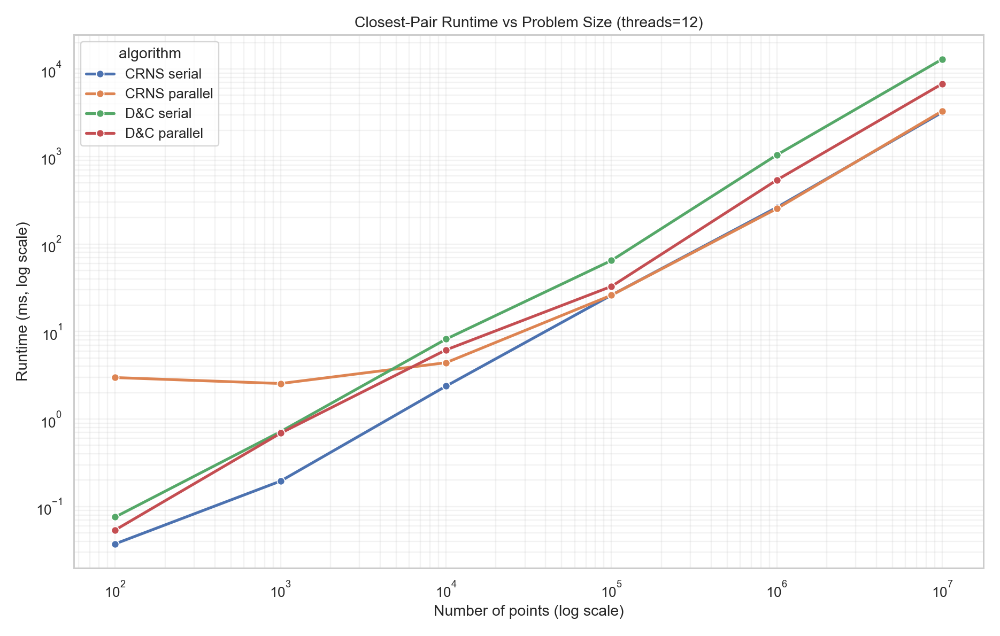
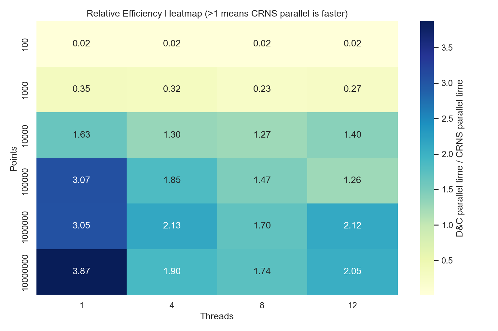

# Closest Pair Benchmark (CRNS, Divide-and-Conquer, Hybrid)

This project benchmarks multiple algorithms for the 2D closest-pair-of-points problem:

- `CRNS` (Cross-Rank Neighbor Search), serial and parallel
- `Divide-and-Conquer`, serial and parallel
- `Hybrid`: parallel divide-and-conquer with CRNS leaf solving
- Optional `O(n^2)` brute-force validation

The executable generates synthetic point clouds, runs selected algorithms, and prints timings, comparisons, and correctness checks.

## Requirements

- CMake 3.16+
- A C++17 compiler
- Threads support (via CMake `Threads::Threads`)
- Windows PowerShell (optional, for `run.ps1`)

## Build

From the repository root:

```powershell
cmake -S . -B build
cmake --build build --config Release
```

Executable path on Windows (Visual Studio generator):

```text
build\Release\closest_pair.exe
```

## Command-Line Usage

```text
closest_pair [--points N | --points=N | -p N]
             [--threads T | --threads=T | -t T]
             [--distribution D | --distribution=D | -d D]
             [--no-bruteforce]
             [--run-divide-conquer]
             [--run-hybrid]
```

### Options

- `--points, -p` Number of generated points (positive integer)
- `--threads, -t` Worker thread count (capped at `hardware_concurrency()`)
- `--distribution, -d` Point distribution in `[0,10]`
- `10` = near-even spread
- `0` = very clumpy
- `--no-bruteforce` Skip brute-force timing + brute-force match checks
- `--run-divide-conquer` Also run serial and parallel divide-and-conquer
- `--run-hybrid` Also run hybrid parallel D&C + CRNS leaves
- `--help, -h` Show usage

### Examples

Run CRNS serial/parallel plus brute-force check:

```powershell
.\build\Release\closest_pair.exe --points 100000 --threads 12 --distribution 8
```

Add divide-and-conquer and hybrid:

```powershell
.\build\Release\closest_pair.exe --points 100000 --threads 12 --distribution 8 --run-divide-conquer --run-hybrid
```

Run only algorithmic variants (skip brute force):

```powershell
.\build\Release\closest_pair.exe --points 1000000 --threads 12 --no-bruteforce --run-divide-conquer --run-hybrid
```

## Benchmark Automation (`run.ps1`)

`run.ps1` runs sweeps of points/threads and exports parsed timings to CSV.

Example:

```powershell
.\run.ps1 `
  -Points "10000,100000,1000000" `
  -Threads "1,6,12" `
  -Distribution 10 `
  -Repeats 3 `
  -RunDivideConquer `
  -NoBruteForce `
  -OutputCsv ".\results.csv"
```

Current script parameters:

- `-Points` comma-separated positive integers
- `-Threads` comma-separated positive integers
- `-Distribution` value in `[0,10]`
- `-Repeats` number of repeats per configuration
- `-ExecutablePath` path to executable
- `-OutputCsv` CSV output path
- `-RunDivideConquer` include D&C runs
- `-NoBruteForce` disable brute-force run
- `-IncludeRawOutput` include full stdout in CSV

## Visual Results

The script in `utils/plot_results.py` can generate publication-friendly figures from `results.csv`:

```powershell
.\utils\.venv\Scripts\python .\utils\plot_results.py --input .\results.csv --outdir .\data
```

### Runtime Growth (threads = 12)

This figure compares runtime scaling across problem sizes on log-log axes.  
In this dataset, CRNS tracks below parallel divide-and-conquer for larger `n`, showing better end-to-end efficiency on the tested machine.



### Relative Efficiency Heatmap (Parallel D&C / Parallel CRNS)

Each cell is:

`divide_and_conquer_parallel_ms / crns_parallel_ms`

Interpretation:

- `> 1.0` means CRNS is faster
- `< 1.0` means divide-and-conquer is faster
- `~ 1.0` means similar performance



## Output Overview

Depending on flags, output includes:

- Closest pair and comparison count per algorithm
- Match checks against brute-force (or cross-checks when brute-force is disabled)
- Timing lines:
- `CRNS serial time (ms): ...`
- `CRNS parallel time (ms): ...`
- `Divide-and-conquer serial time (ms): ...`
- `Divide-and-conquer parallel time (ms): ...`
- `Hybrid time (ms): ...`
- `Brute force time (ms): ...`

## Project Files

- `CP.cpp` main implementation and CLI
- `CMakeLists.txt` CMake build definition
- `run.ps1` benchmark sweep script with CSV export
- `results.csv` / `tmp_bench.csv` example benchmark outputs
- `report/` paper/report drafts and notes
